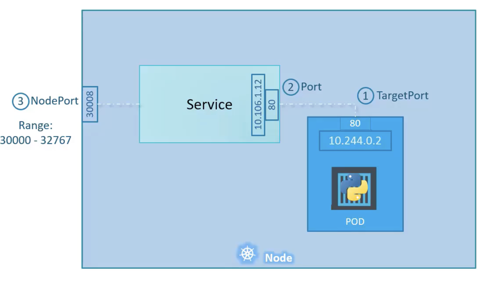

***Services: NodePort***

> Deployment runs app. Services exposes app.

1. Service in kubernetes are ways to expose pods running on node to external users. This is needed because of how networking works in kubernetes.

2. In Kubernetes - each node has an ip address (lets say 192.168.1.1). Inside the node a separate internal network is created for internal communication.

3. When pods spins up inside a node, a middleman is needed to expose internal pods to external user. (see image)

4. There are three types of services. We are going to learn about NodePort first.
5. Lets create a deployment, this is no different from deployment created before.
```
kubectl create -f ./resources/deployment.yaml
```
6. At this moment there is not way for us to access this service on our browser. Lets create a service to solve this.
7. We have created at `./resources/service_nodeport.yaml`
8. We can start the service
```shell
# Step 1: create service
kubectl create -f ./resources/service_nodeport.yaml

# Step 2: verify serivce created
kubectl get service
```
9. Now, the service is available for access on port 30010 on worker node ip. To find worker node ip
```shell
# To find the url
minikube service myapp-service --url
```