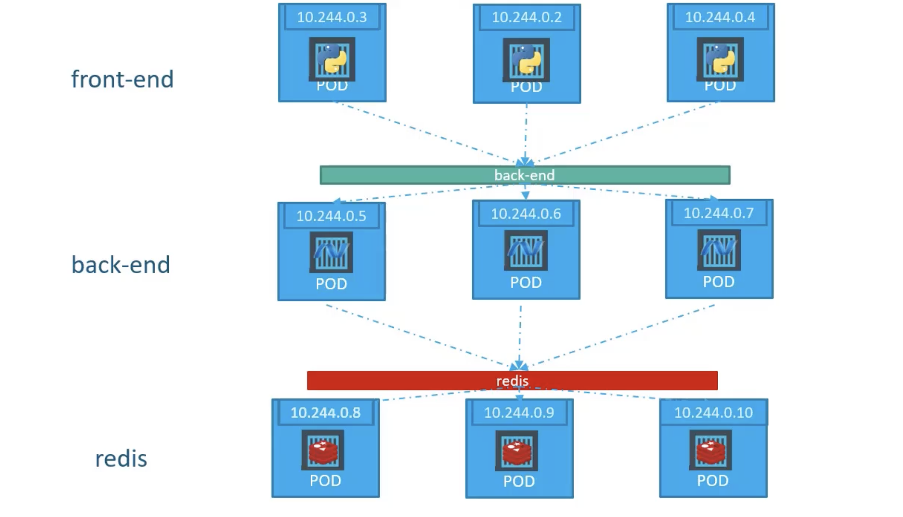

***Services: ClusterIP***
1. When there are multiple layers of services deployed such as frontend, backend and data layer, with each layer having multiple pods. Then, how do pods from one layer findout about ips of pods in other layer? Also, pods dont have static ip - it might change, pod might die.

2. This is when service of ClusterType is used. It abstract behind all the pods of single layer, and other layers can now talk to this layer with single ip 


5. Lets create a deployment, this is no different from deployment created before.
```
kubectl create -f ./resources/deployment.yaml
```
6. At this moment there is not way for us to access this service on our browser. Lets create a service to solve this.
7. We have created at `./resources/service_cluster_ip.yaml`
8. We can start the service
```shell
# Step 1: create service
kubectl create -f ./resources/service_cluster_ip.yaml

# Step 2: verify serivce created
kubectl get service
```
9. Now, the service is available for access on port 30010 on worker node ip. To find worker node ip
```shell
# To find the url
minikube service myapp-service --url
```